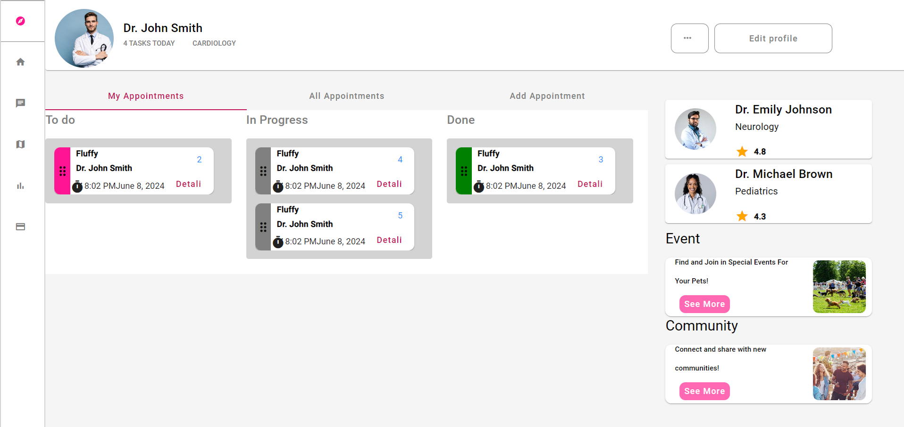

# VetApp

O aplicatie frontend Angular prin care se face managementul programarilor la un cabinet veterinar,cu atentie deosbita pentrut usability si aspect.

## ASPECTE GENERALE

### Models
- IAnimalModel modelul pentru animal
- IAppointmentModel modelul pentru programare
- IDoctorModel modelul pentru doctor

### Servicii
- appointment.services.ts 
- doctor.services.ts

### Data
- animal.data.ts
- doctor.data.ts
- appointments.data.ts

Am folosit varianta de 'mock data' pe care am tinut-o in memorie

### Pagini
- Doctor's Page (aceasta este pagina principala,in care sunt implementate paginile urmatoare)
- My Appointments (programarile mele )
- Details Page (pagina cu detalile unei programari)
- All Appointments (toate programarile)
- Add Appointment (adauga o programare noua)

### My Appointments

Toate functionalitatile au fost implementate.Nu este exact ca in design (acesta fiind patrat), nu am avut loc sa pun 3 doctori in dreapta asa ca am pus doar 2. BONUS: au fost implementate.

