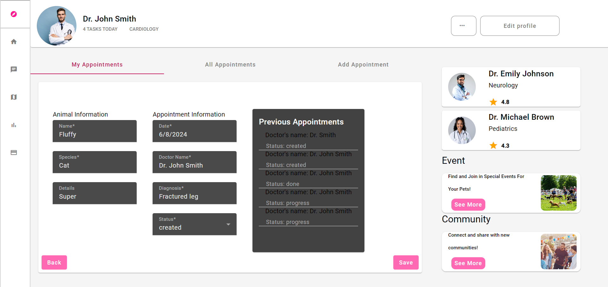
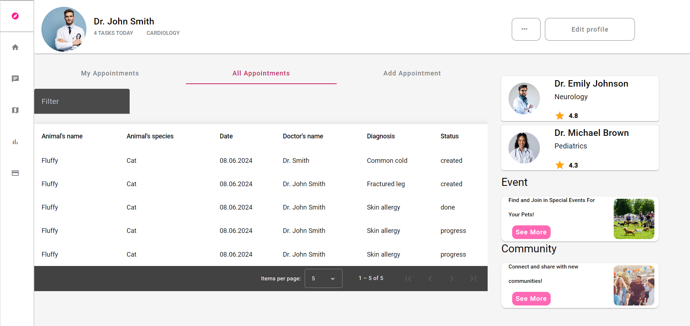
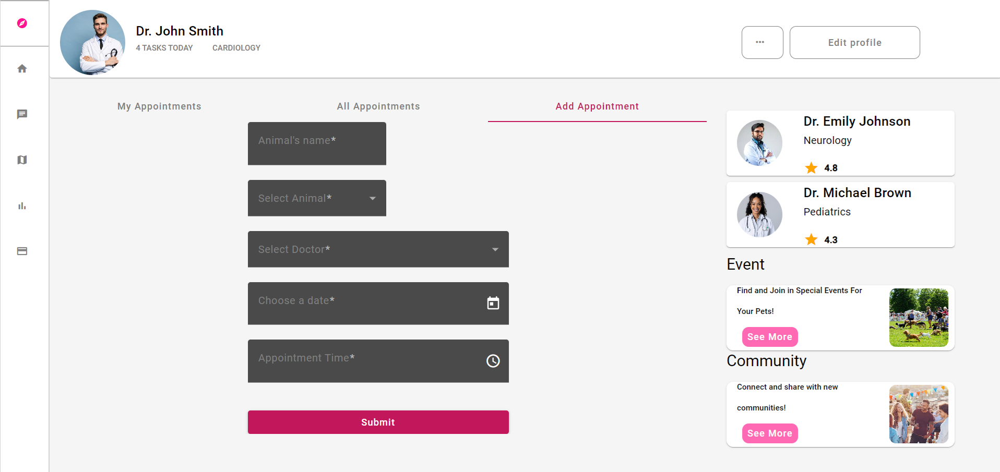

## ASPECTE GENERALE

### Models
- IAnimalModel modelul pentru animal
- IAppointmentModel modelul pentru programare
- IDoctorModel modelul pentru doctor

### Servicii
- appointment.services.ts 
- doctor.services.ts

### Data
- animal.data.ts
- doctor.data.ts
- appointments.data.ts

Am folosit varianta de 'mock data' pe care am tinut-o in memorie

### Pagini
- Doctor's Page (aceasta este pagina principala,in care sunt implementate paginile urmatoare)
- My Appointments (programarile mele )
- Details Page (pagina cu detaliile unei programari)
- All Appointments (toate programarile)
- Add Appointment (adauga o programare noua)

### My Appointments

Toate functionalitatile au fost implementate.Nu este exact ca in design (acesta fiind patrat), nu am avut loc sa pun 3 doctori in dreapta asa ca am pus doar 2. BONUS: au fost implementate.

### Details

Aici este o pagina cu detaliile unei programari,acestea se pot edita. Bonus: am facut un mic tabel care arata ultimele programari.(aici am pus din toate animalele doar pentru a afisa ceva ca sa nu mai imi bat capu cu un animal care sa aiba mai multe programari)

### All Appointments

Aici este un tabel cu toate programarile,are paginator deci se pot selecta cate vreti sa fie pe pagina. Am ales sa fac un filtru care filtreaza dupa toate coloanele din tabel. Sortarea la fel.

### Add Appointment

Aici se poate adauga o programare in care selectam un animal,un doctor,data + timpul user friendly si programarea va avea statusul "creata" by default.

#### Lucruri care necesita imbunatatite in opinia mea

Nu e foarte responsive. N-am mai facut pana acum vre-un site responsive.Totusi s-a incercat.

Se mai poate lucra la design nu e chiar 1 la 1 cu screenshot-ul.

La pagina all-appointments nu este implementat ca filtru sa salveze programarile.
